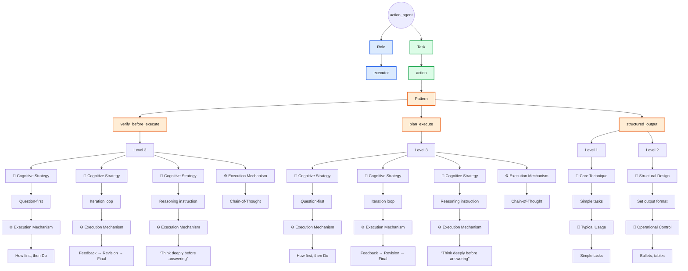
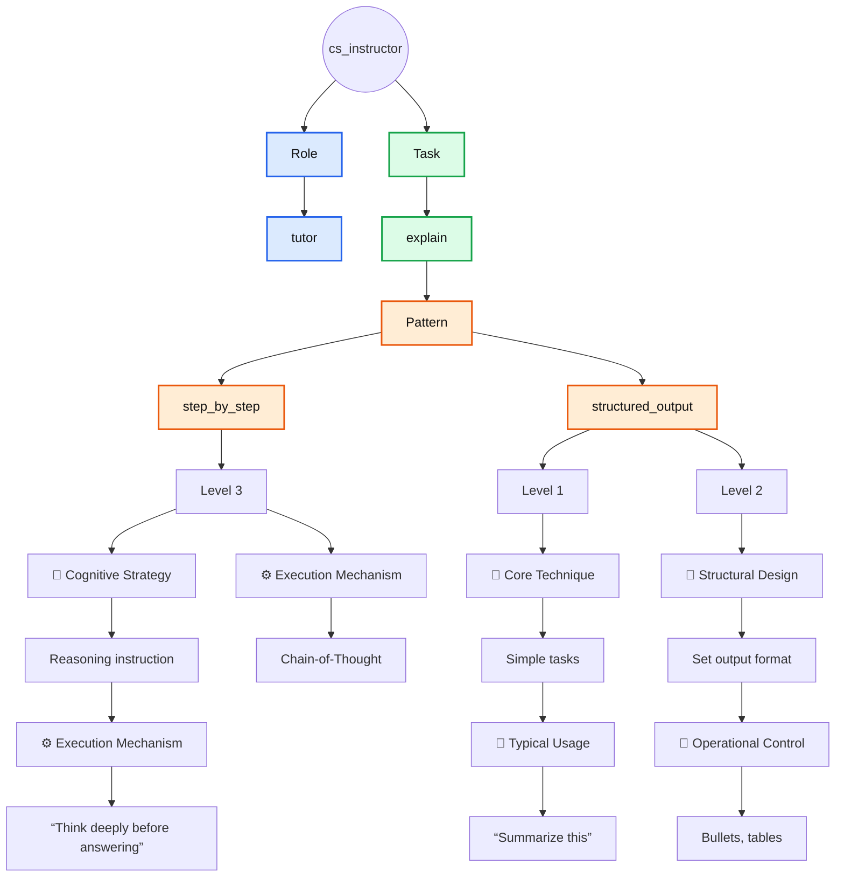
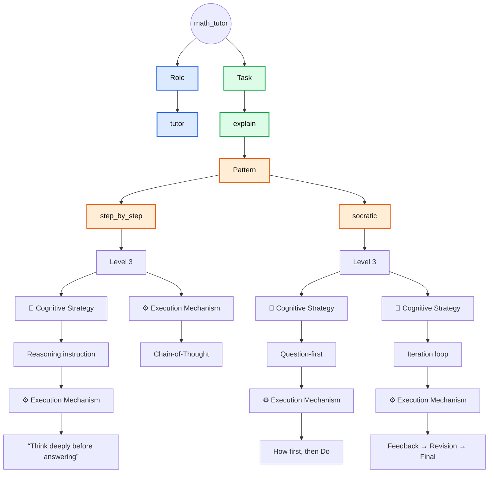

# Default Agents

Reference implementations of default agents designed around different
functional focuses and reasoning patterns.

> [!IMPORTANT]
> **Default Agents** are organized by their primary area of focus, which guides how they approach tasks and structure their reasoning. While each default agent is designed with a particular focus in mind, they remain capable of assisting with requests beyond that scope when needed.

> [!NOTE]
> Table columns that follow **Pattern** represent matches with corresponding elements in [The Iceberg Of Prompting](../../the_iceberg_of_prompting.md) framework.

## Agent: `action_agent`

### Description

An execution-focused agent designed to perform tasks by verifying requirements or planning before acting, using reasoning strategies and structured outputs to ensure accurate and controlled results.

### Usage

```bash
pp build action_agent --var action="<action>" --copy
```

### Example

```bash
pp build action_agent --var action="Make a shopping list"
```

### Specification Table

| Role                 | Task     | Pattern               | 🧠 Cognitive Strategy | ⚙️ Execution Mechanism          |
|----------------------|----------|-----------------------|-----------------------|---------------------------------|
| executor             | action   | verify_before_execute | Question-first        | How first, then Do              |
| executor             | action   | verify_before_execute | Iteration loop        | Feedback → Revision → Final     |
| executor             | action   | verify_before_execute | Reasoning instruction | “Think deeply before answering” |
| executor             | action   | verify_before_execute | —                     | Chain-of-Thought                |
| executor             | action   | plan_execute          | Question-first        | How first, then Do              |
| executor             | action   | plan_execute          | Iteration loop        | Feedback → Revision → Final     |
| executor             | action   | plan_execute          | Reasoning instruction | “Think deeply before answering” |
| executor             | action   | plan_execute          | —                     | Chain-of-Thought                |

| Role                 | Task    | Pattern           | 🧩 Core Technique     | 🎯 Typical Usage                |
|----------------------|---------|-------------------|-----------------------|---------------------------------|
| executor             | action  | structured_output |Simple tasks           |“Summarize this”                 |

| Role                 | Task    | Pattern           | 📐 Structural Design  | 🚦 Operational Control          |
|----------------------|---------|-------------------|-----------------------|---------------------------------|
| executor             | action  | structured_output |Set output format      |Bullets, tables                  |

### Flowchart



## Agent: `cs_instructor`

### Description

A technical teaching agent specialized in explaining computer science concepts step by step, using reasoning strategies and structured outputs to make complex topics easier to understand.

### Usage

```bash
pp build cs_instructor --var input="<input>" --copy
```

### Example

```bash
pp build cs_instructor --var input="Switch, explained for beginners" --copy
```

### Specification Table

| Role                 | Task    | Pattern           | 🧠 Cognitive Strategy | ⚙️ Execution Mechanism          |
|----------------------|---------|-------------------|-----------------------|---------------------------------|
| technical_instructor | explain | step_by_step      | Reasoning instruction | “Think deeply before answering” |
| technical_instructor | explain | step_by_step      | —                     | Chain-of-Thought                |

| Role                 | Task    | Pattern           | 🧩 Core Technique     | 🎯 Typical Usage                |
|----------------------|---------|-------------------|-----------------------|---------------------------------|
| technical_instructor | explain | structured_output |Simple tasks           |“Summarize this”                 |

| Role                 | Task    | Pattern           | 📐 Structural Design  | 🚦 Operational Control          |
|----------------------|---------|-------------------|-----------------------|---------------------------------|
| technical_instructor | explain | structured_output |Set output format      |Bullets, tables                  |

### Flowchart



## Agent: `math_tutor`

### Description

An educational agent that teaches mathematical concepts through step-by-step explanations and Socratic questioning, encouraging reasoning and iterative understanding.

### Usage

```bash
pp build math_tutor --var input="<input>" --copy
```

### Example

```bash
pp build math_tutor --var input="Explain recursion" --copy
```

### Specification Table

| Role  | Task    | Pattern        | 🧠 Cognitive Strategy | ⚙️ Execution Mechanism            |
|-------|---------|----------------|-----------------------|-----------------------------------|
| tutor | explain | step_by_step   | Reasoning instruction | “Think deeply before answering”   |
| tutor | explain | step_by_step   | —                     | Chain-of-Thought                  |
| tutor | explain | socratic       | Question-first        | How first, then Do                |
| tutor | explain | socratic       | Iteration loop        | Feedback → Revision → Final       |

### Flowchart


